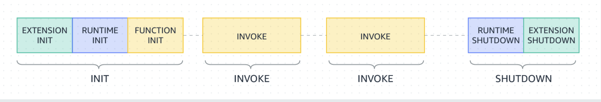

# Lambda execution environment lifecycle

**Q1**:How does Lambda run a function , and what APIs are used for communication ? 

**Solution**:

- Lambda invokes our function in an execution environment, which provides a secure and isolated runtime environment.
- When creating a Lambda function, you set **configuration details** like memory size and timeout — Lambda uses these to create the **execution environment**.
- The **runtime and extensions** run inside that environment and **share permissions, resources, credentials, and environment variables**.
- Function's runtime communicates with Lambda using the Runtime API 
- Extensions communicate with Lambda using the Extensions API 
- Lambda sends telemetry data (logs, metrics,traces) to telemetry API and extensions receive this data through Telemetry API         

External extensions ➡️sidecard helpers that add monitoring or observability features

**Q2**: Draw a picture of Lambda execution environment lifecycle ? 

**Solution**:

**Q3**:This is a picture of Lambda execution environment lifecycle 

How does Lambda manage each phase of the Lambda's execution environment lifecycle ? 

**Solution**:

-  Each phase starts with an event that Lambda sends to the runtime and to all registered extensions
- The  runtime and each extension indicate completion by sending a `Next` API request
- Lambda freezes the        execution environment when the runtime and each extension have completed and there are no pending events.

Init Phase

In the `Init` phase, Lambda performs three tasks:

- Start all extensions (`Extension init`)
- Bootstrap the runtime (`Runtime init`)
- Run the function's static code (`Function init`)
- Run any before-checkpoint [runtime hooks](https://docs.aws.amazon.com/lambda/latest/dg/snapstart-runtime-hooks.html) (Lambda SnapStart only ,This is only for Java we can ignore it ❌)

The `Init` phase ends when the runtime and all extensions signal that they are ready by sending a            `Next` API request. The `Init` phase is limited to 10 seconds. 

If Lambda can’t finish setting up the init phase  (starting extensions, runtime, and static code) within **10 seconds**,
 it **pauses the setup** and waits until the **first real invocation** of your function.

When that first request comes in, Lambda **retries the Init phase, but this time it uses our **configured function timeout** — the same limit you set when creating the function (for example, 30 s, 60 s, or even up to 900 s).

That timeout defines how long your function — including initialization — is allowed to run before Lambda stops it.

Note ➡️

The 10-second timeout doesn't apply to functions that are using provisioned concurrency  or SnapStart(Java ❌). For provisioned concurrency and SnapStart functions(Java ❌) , our initialization code   can run for up to 15 minutes. The time limit is 130 seconds or the configured function              timeout (maximum 900 seconds), whichever is higher.

Note ➡️

When we use provisioned concurrency, Lambda initializes the execution environment when you  configure the PC settings for a function. Lambda also ensures that          initialized execution environments are always available in  advance of invocations. 

You may see gaps between your function's  invocation and initialization phases.

Why Gaps between initialization and invocation phase ? 

Provisioned Concurrency means AWS **sets up your function in advance** (pre-warmed).
 So sometimes you’ll see in logs that the **Init phase happened earlier**, and then much later the **Invoke phase** (when your code actually runs).
 That “gap” just means your function was **ready and waiting** before a request arrived — not that it was slow.

 Depending on your  function's runtime and memory configuration, you may also see variable latency on the first invocation on an initialized execution  environment.

Why Variable latency on the first invocation ? 

Even though the function is pre-warmed, the **first request** can still take a bit longer.That’s because Lambda still does a few small setup steps — like giving memory, CPU, and connecting everything — before running your code.
 It’s normal and short (a few milliseconds), not a cold start.

For functions using on-demand concurrency, Lambda may occasionally initialize execution environments ahead of          invocation requests. When this happens, you may also observe a time gap between your function's initialization and  invocation phases. We recommend you to not take a dependency on this behavior.

**On-demand concurrency:** Lambda’s default mode — it creates environments only when requests come in.
 Sometimes AWS prepares them early (to reduce delay), but it’s not guaranteed.
 So, no pre-warming like provisioned concurrency — it runs only when needed.

## Failures during the Init phase

If a function crashes or times out during the `Init` phase, Lambda emits error information in the `INIT_REPORT` log.

If the `Init` phase is successful, Lambda doesn't emit the `INIT_REPORT` log unless SnapStart or  provisioned concurrency is enabled. SnapStart and provisioned concurrency functions always emit `INIT_REPORT`

### Restore phase (Lambda SnapStart only) ❌ (Only Java)

When you first invoke a [SnapStart](https://docs.aws.amazon.com/lambda/latest/dg/snapstart.html) function and as the function scales up, Lambda resumes new execution  environments from the persisted snapshot instead of initializing the  function from scratch. If you have an after-restore [runtime hook](https://docs.aws.amazon.com/lambda/latest/dg/snapstart-runtime-hooks.html), the code runs at the end of the `Restore` phase. You are charged for the duration of after-restore runtime hooks. The runtime must load and after-restore runtime hooks must complete  within the timeout limit (10 seconds). Otherwise, you'll get a  SnapStartTimeoutException. When the `Restore` phase completes, Lambda invokes the function handler (the [Invoke phase](https://docs.aws.amazon.com/lambda/latest/dg/lambda-runtime-environment.html#runtimes-lifecycle-invoke)).

#### Failures during the Restore phase ❌

If the `Restore` phase fails, Lambda emits error information in the `RESTORE_REPORT` log.

---

